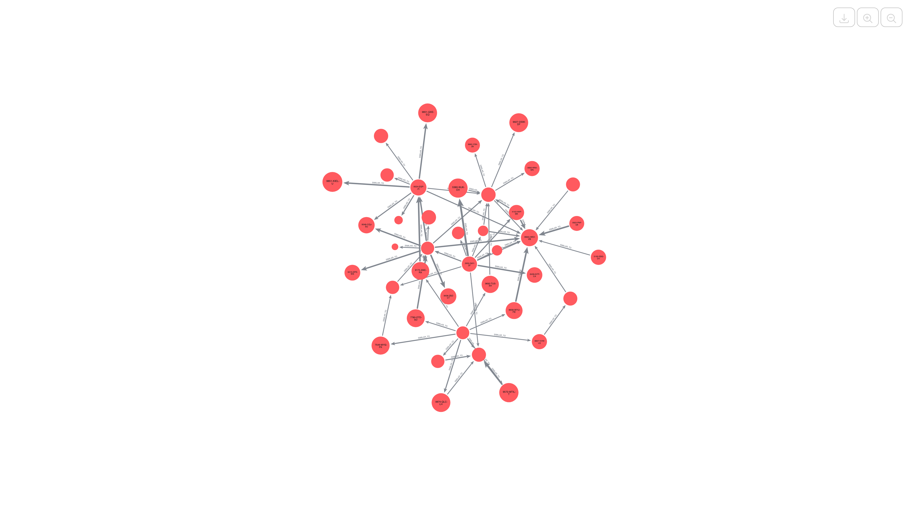
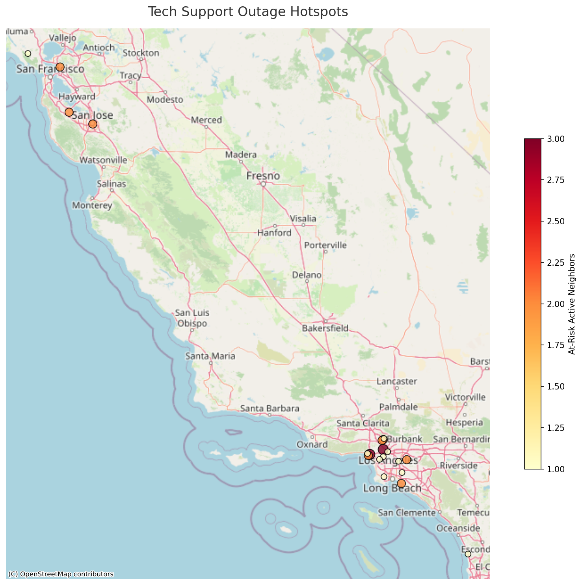
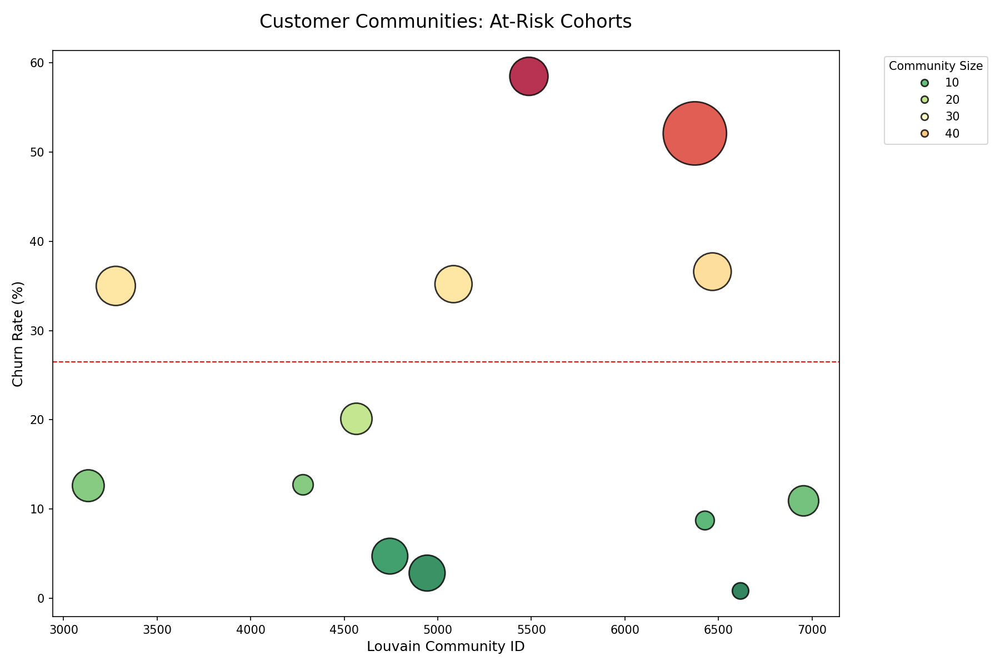

# Subscriber & Network Analytics with Neo4j and Graph Data Science

<p align="center">
  
  <br>
  <sub>Tightly connected groups of similar customers</sub>
</p>

This project is a business analytics use case for telecom and subscriber services churn that combines Neo4j, Graph Data Science, and [Streamlit](https://streamlit.io/). It turns customer records into a connected Customer 360 graph and uses that structure to explain risk, not just score it. The result is an interactive experience where teams can move from broad KPIs to customer neighborhoods, community risk, geographic patterns, and recommendation-style signals.

From a business perspective, the goal is better retention decisions with less guesswork. Churn is usually analyzed in flat tables, but many churn drivers are relational, such as shared service bundles, similar customer profiles, and local infrastructure patterns. Our graph-first approach helps teams identify where risk concentrates, why it is likely happening, and which active customers look most exposed. It supports practical workflows such as prioritizing outreach, designing segment-specific offers, and communicating risk rationale to non-technical stakeholders.

<p align="center">
  
  <br>
  <sub>The schema design</sub>
</p>

From a technical perspective, the repository implements a layered pipeline. The loading stage in [`loader.ipynb`](loader.ipynb) pulls the [IBM Telco Churn dataset](https://www.kaggle.com/yeanzc/telco-customer-churn-ibm-dataset) from Kaggle, standardizes schema and types, and writes core domain entities and relationships into Neo4j. The enrichment stage in [`enrich.ipynb`](enrich.ipynb) adds synthetic but statistically consistent movie behavior, creating `Movie` nodes and `WATCHED_MOVIE` and `RATED` relationships to extend the graph with engagement signals. The analytics stage in [`analysis.ipynb`](analysis.ipynb) applies Graph Data Science methods such as FastRP embeddings, Louvain communities, hybrid feature construction, and kNN write-back of `NEAREST_NEIGHBOR` relationships. The application stage in [`app.py`](app.py) runs Cypher queries and renders both tables and network visualizations in Streamlit.

<p align="center">
  
  <br>
  <sub>Tech support outage hotspots</sub>
</p>

The architecture is intentionally simple to operate. Neo4j is the system of record for graph entities, graph features, and derived relationships. Python notebooks are used for reproducible preprocessing and feature generation. Streamlit is used for the presentation layer and exploratory analysis UX. The helper module `neo4j_analysis.py` centralizes query execution, dataframe conversion, graph-result extraction, and visualization support so the UI code stays focused on business-facing interactions.

The application expects environment configuration in a local `.env` file. The required Neo4j settings are `NEO4J_URI`, `NEO4J_USER`, `NEO4J_PASSWORD`, and `NEO4J_DATABASE`. The data ingestion notebook also expects `DOWNLOAD_PATH` for the Kaggle download destination. The agent section in the app is optional and only works when Aura API credentials are provided through `AURA_API_CLIENT_ID`, `AURA_API_CLIENT_SECRET`, and `AURA_API_TEXT2CYPHER_ENDPOINT`.

<p align="center">
  
  <br>
  <sub>At-risk communities with Louvain</sub>
</p>

To run the solution end to end, create the Conda environment from `environment.yml`, activate it, configure `.env`, run the notebooks in sequence, and then launch Streamlit. Running notebooks in order matters because the app depends on relationships and properties created during preprocessing, especially embeddings, macro reasons, and nearest-neighbor edges.

```bash
conda env create -f environment.yml
conda activate customer360-churn
```

```env
NEO4J_URI=neo4j+s://<your-host>
NEO4J_USER=<your-user>
NEO4J_PASSWORD=<your-password>
NEO4J_DATABASE=neo4j
DOWNLOAD_PATH=.data

# Optional, only for Agent-Based Analysis in app.py
AURA_API_CLIENT_ID=
AURA_API_CLIENT_SECRET=
AURA_API_TEXT2CYPHER_ENDPOINT=
```

After environment setup, execute `loader.ipynb`, then `enrich.ipynb`, then `analysis.ipynb` against the same Neo4j database. Once preprocessing is complete, start the app with the command below.

```bash
streamlit run app.py
```

>If sections in the UI appear empty, the most common cause is partial preprocessing in the target database. Re-running the notebook sequence in order usually resolves it.
